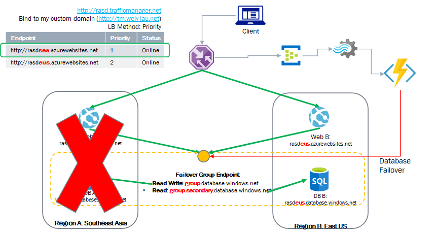
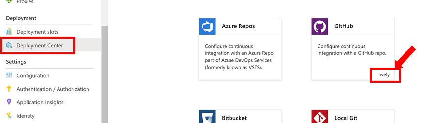
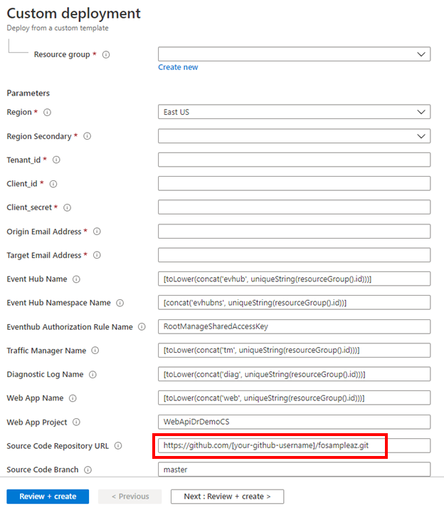
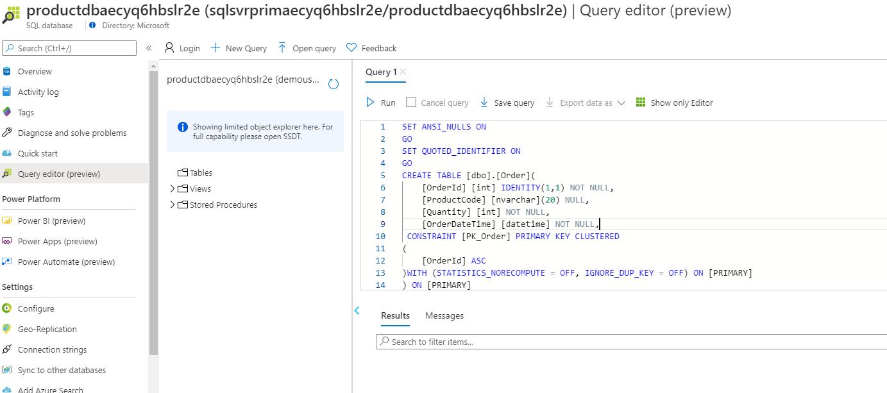
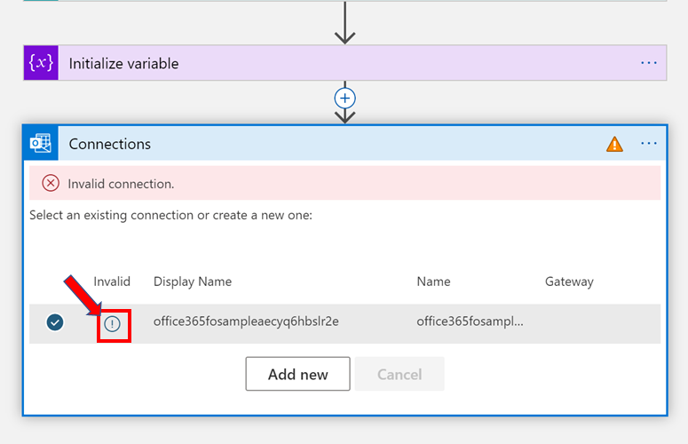
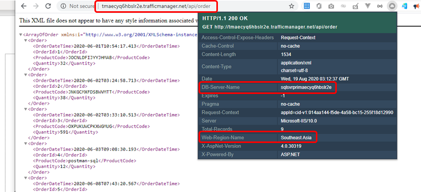

# Implementing multi-region deployment and disaster recovery in Azure

This repository complements this [video series](https://www.youtube.com/playlist?list=PLe32w3jNLanrZ9_X58_3d13tQ5REMmnK3) where we demonstrated  how to perform a failover on Web App and Database in Azure when one of the region goes down.
This solution uses a number of Azure services such as App Service, SQL Datbase, Traffic Manager, EventHub, Steam Analytics, Azure Function and Logic App.

In case you missed the video series, here's the solution architecture:

We aim to make this deployment and configuration process as simple as possible.

This project contains:

1. Source codes used in the demo which includes the [sample web api project](SourceCode/WebApiDrDemoCS/) built-with .NET and Visual Studio as well as [Azure Function project](SourceCode/FunctionAppFailover/).
2. ARM Deployment template which you can easily deploy entire solution to Azure with just a SINGLE CLICK!
3. [Slides](https://github.com/wely/fosampleaz/tree/master/slides) that i presented in the video series

<!-- # How to perform SINGLE CLICK deployment -->

## Prerequisites

### 1. Login or Create an account

Create a Azure account in your if don't have one ([Login/Register Azure Account](https://azure.microsoft.com/en-us/free/)).

### 2. Fork this repository

Fork this repo, and you will start editing your own version of this projects. ([What is Fork?](https://help.github.com/en/github/getting-started-with-github/fork-a-repo)).

### 3. Associate your GitHub account in Azure Function for Continuous integration
Verify if you've ever done the integration in your subscription. You can go to the new App Service or Azure Function, then click on Deployment Center. This screenshot indicates that i've done the association to my GitHub account.

If you have never associated your GitHub account in the Azure portal before, please do it by referring to [this link](https://docs.microsoft.com/en-us/azure/azure-functions/functions-continuous-deployment#credentials) for instruction.

### 4. Getting ready your necessary keys and secrets

In this step, you need to create AAD (Azure Active Directory) App Client and Retreived the keys

Firstly, we need to create AAD App Client and retreived several information such as **tenant_id, grant_type, client_id, client_secret**.

Please go through this link tutorial to get required information to be added later: https://blog.jongallant.com/2017/11/azure-rest-apis-postman/

**Ensure you keep those information securely and avoid exposing those to the public.** 

## One Click deployment

Now, we are deploying all necessary resources with just one unified deployment template.

Click below button to automatically deploy your instances using Azure ARM Template:

You will soon be routed to Azure Portal with custom deployment template creation wizard just like the following screen. 

Choose your existing resource group or create a new one. Then choose the **Region (primary) and the secondary region**. Enter **tenant_id, client_id, client_secret** that we got from ealier to your deployment paramter. They are primarily used as authorization keys to perform Database Failover programmatically thru our Azure Functions.

**IMPORTANT**: On the "Source Code Repository URL", make sure you update **[your-github-username]** accordingly. 

Most of the parameters have been prefilled with the default values. You may optionally update them to your preferred values. Make sure you read the description carefully.

Click "**Next: Review + create >**" button for validation and finally "**Review + create**" to proceed.

## Post deployment configuration

As you notice that we try to simplify the deployment process as automated as possible. However, there will be one step which we require you to perform manually:

1. Load the database with sample table and data.

We have provided the sample .sql file [here](Deployment/fodbscript.sql).
You can either your SQL Server Management Studio or [Query Editor (in Azure Portal)](https://docs.microsoft.com/en-us/azure/azure-sql/database/connect-query-portal) to execute the SQL file as can be seen in the diagram.

**You might need to explicitly [allow your client ip address on the SQL Server firewall.](https://docs.microsoft.com/en-us/azure/azure-sql/database/firewall-create-server-level-portal-quickstart)**

2. Granting Logic App permission to send email thru your Office 365 account.

After deployment is successful, open your Azure portal, go to Logic App (it should be named with prefix of **failoverflow** by default. Click the Logic app designer, expand the "**Send an email (V2)**" step, click on the (!) and login with Office 365 account.

## Verification
The first step of verification is to invoke the Traffic Manager endpoint by appending /api/order. 

Notice that the HTTP Headers indicates that the request was served by Web and DB both from the primary region. 

## KNOWN ISSUES 

Please refer to the [known issues](known-issue.md) doc in case you've encontered any issue.

## You're all set

Now you may start testing your failover the database or app. Refer to my [video #7](https://www.youtube.com/watch?v=phjIB4lp4DY) to perform failover to the secondary region.

