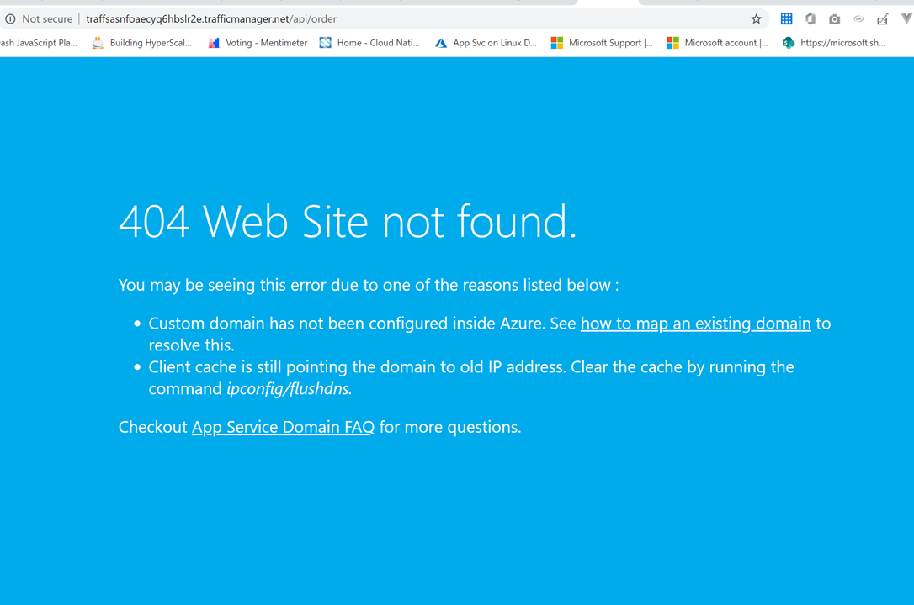
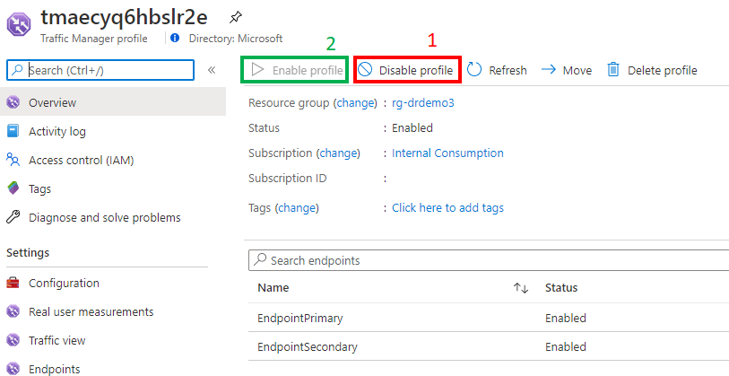

# Known-issues

### 1. Deployment failed

It typically takes about less than 15 minutes to deploy the solution. 

If you face any error such as Conflict, i suggest you to redeploy agian. If it's still doesn't help, feel free to raise a GitHub issue. 

### 2. Traffic Manager DNS flush / reset
You might encounter the following error when accesing the traffic manager endpoint:

This is mostlikely because traffic manager requires sometime to propagate the DNS, in the event where the previous deployment take place.  
If this issue still persists after 10 mins, i'd recommend you to navigate to your Traffic Manager and "Disable the profile". Wait for a few second, then click the "Enable profile".

### 3. Database Copy
We created a sample database table along with some dummy data as part of deployment template using Database Copy.
 
In the even if you don't see the table created, please run the [following script](../Deployment/fodbscript.sql) manually. 