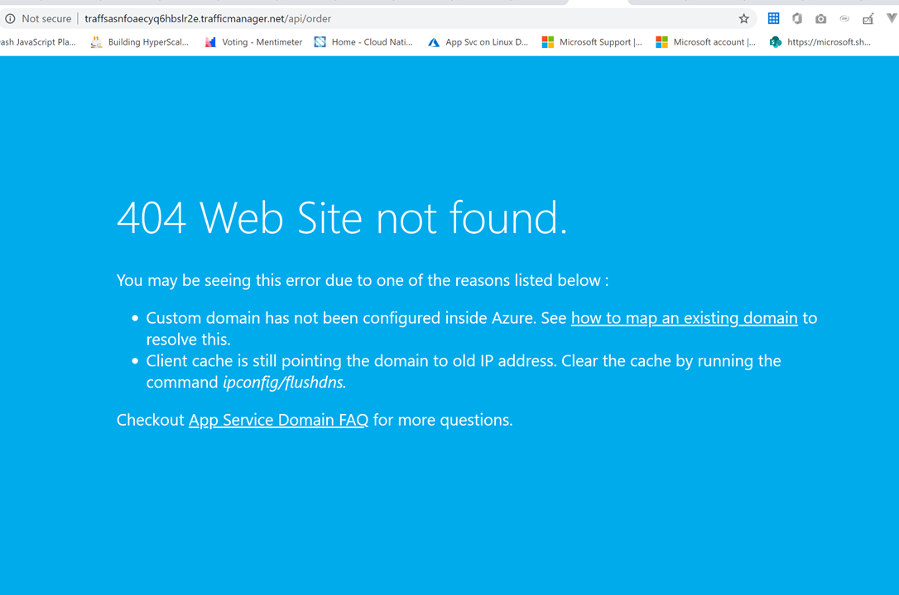
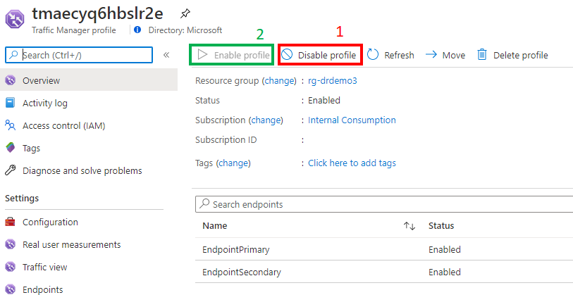
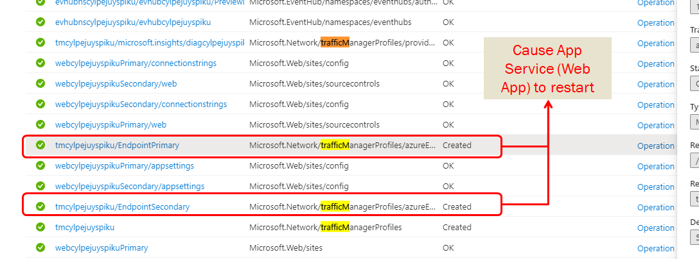
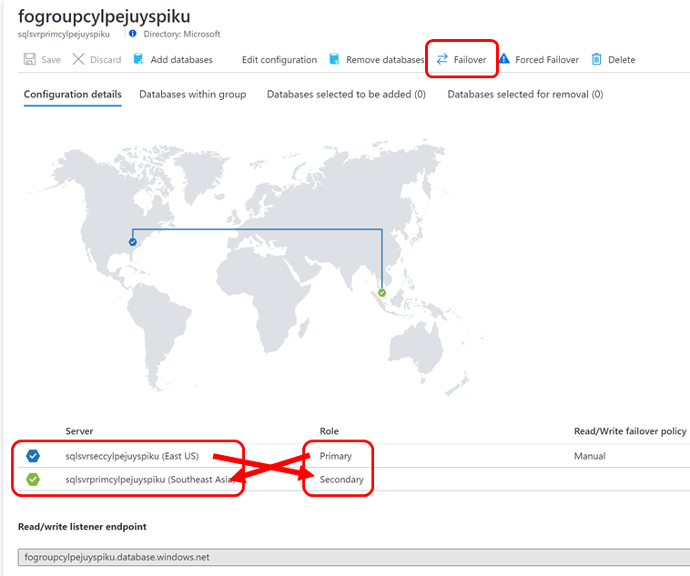

# Known-issues

### 1. Deployment failed

It typically takes about less than 15 minutes to deploy the solution. 

If you face any error such as Conflict, i suggest you to redeploy agian. If it's still doesn't help, feel free to raise a GitHub issue. 

### 2. Traffic Manager DNS flush / reset
You might encounter the following error when accesing the traffic manager endpoint:

This is mostlikely because traffic manager requires sometime to propagate the DNS, in the event where the previous deployment take place.  
If this issue still persists after 10 mins, i'd recommend you to navigate to your Traffic Manager and "Disable the profile". Wait for a few second, then click the "Enable profile".

### 3. Initial (1 time) database failover upon the deployment completion
We realize that there's an automated database failover immediately after the resource creation (via ARM).
This is because the binding of App Service to Traffic Manager will cause App Service to restart. As such, Traffic Manager will receive the "Down" status, which eventually invokes Database Failover thru the Azure Function.

Resolution: 
You can just perform a manual database failover to revert back the state. To do that, go to the primary SQL Server resource, click "Failover groups" menu, choose the failover group and finally click Failover button.

## Facing another issue that can't be solved? 
Feel free to file a issue for this repo in GitHub.